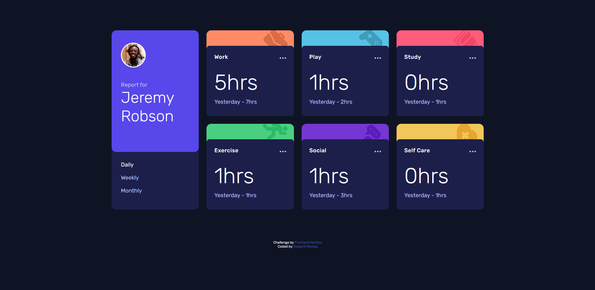

# Frontend Mentor - Time tracking dashboard solution

This is a solution to the [Time tracking dashboard challenge on Frontend Mentor](https://www.frontendmentor.io/challenges/time-tracking-dashboard-UIQ7167Jw). Frontend Mentor challenges help you improve your coding skills by building realistic projects.

[Challenge Text](CHALLENGE.md)  
[Style Guide](style-guide.md) 

## Table of contents

- [Overview](#overview)
  - [The challenge](#the-challenge)
  - [Screenshot](#screenshot)
  - [Links](#links)
- [My process](#my-process)
  - [Built with](#built-with)
  - [What I learned](#what-i-learned)
  - [Continued development](#continued-development)
- [Author](#author)

## Overview

### The challenge

Users should be able to:

- View the optimal layout for the site depending on their device's screen size
- See hover states for all interactive elements on the page
- Switch between viewing Daily, Weekly, and Monthly stats

### Screenshot

### Links

- Solution URL: [GitHub Code](https://github.com/Cjmax10/time-tracking-dashboard)
- Live Site URL: [Live Site](https://cjmax10.github.io/time-tracking-dashboard/)

## My process

### Built with

- Semantic HTML5 markup
- CSS custom properties
- Flexbox
- CSS Grid
- XHR Object

### What I learned

- Fetching data using XHR Object
- CSS GRID

### Continued development

Would love to implement the same solution in React

## Author

- Website - [Swapnil Markal](https://cjmax10.github.io/Portfolio/)
- Frontend Mentor - [@Cjmax10](https://www.frontendmentor.io/profile/Cjmax10)